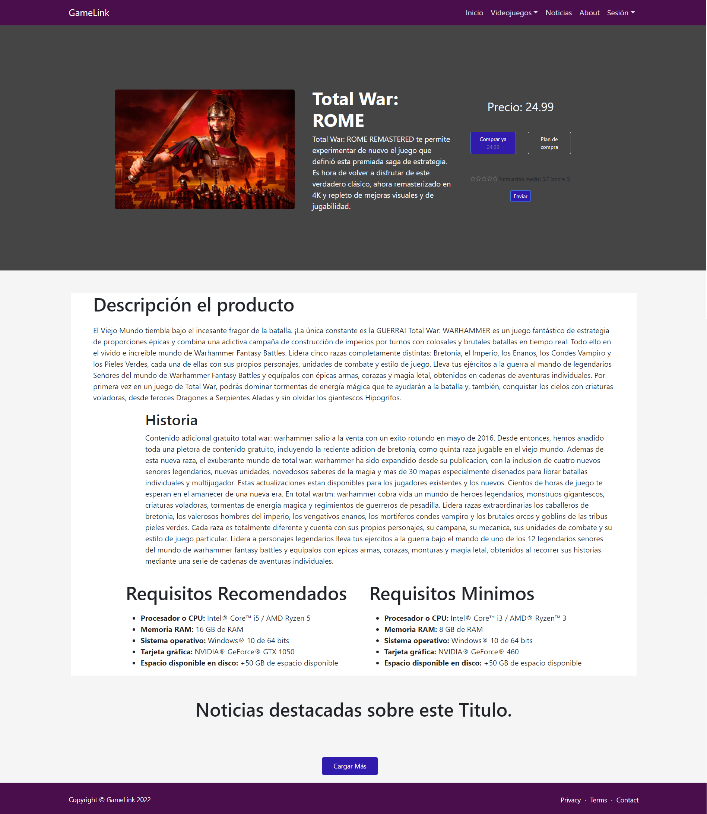

# Nombre de la aplicación web: 
GameLink

# Integrantes del equipo de desarrollo: 
| Nombre | Correo | Usuario GutHub |
| --- | --- | --- |
| Andrea Patricia Acuña Padrón | ap.acuna.2019@alumnos.urjc.es | andrecupa |
| Carlos Fuentes Díaz | c.fuentesd.2019@alumnos.urjc.es | Xarlifue360 |
| Jhostin Davis Ortiz Moreno | jd.ortiz.2019@alumnos.urjc.es | JhostinD | 
| Mani Víctor Patel Bentz | mv.patel.2019@alumnos.urjc.es | ultramani |
| Juan Luis Rico Rus | jl.rico.2019@alumnos.urjc.es | JLRR2019 |

# Herramienta de organización para el equipo:
Link Trello: 
* [Trello](https://trello.com/b/LKtXzdMY/organizaci%C3%B3n)

# Aspectos principales de la aplicación web:

## 1.ENTIDADES

La web consta de 4 entidades:

#### Usuario:
Id, nick, contraseña, tarjeta de crédito, Nombre, apellidos, foto perfil, correo electrónico, juegos comprados, noticias leídas.

#### Videojuego:
Id, Título, descripción, puntuación, carátula, empresa, precio, género, lista de noticias asociadas.

#### Noticias:
Id, Título, descripción, foto(opcional), autor, remesa, lista de videojuegos relacionados.

#### CódigoCompra:
Id, codigo de compra, nombre videojuego asociado, descuento.

Relaciones de las entidades:

El usuario administrador puede publicar de 0 a infinitas noticias, videojuegos y códigos.
 El usuario administrador puede eliminar y/o modificar de 0 a infinitas noticias, videojuegos y códigos publicados previamente.
Una noticia tiene uno o varios videojuegos asociados.
Un códigoCompra es de un videojuego.
Un usuario registrado compra de cero a infinitos videojuegos.
Un usuario puede visualizar noticias y videojuegos.

## 2.PERMISOS DE LOS USUARIOS

(la Web tiene que estar diseñada para que ciertos usuarios sean dueños de ciertos datos, importante para implementar correctamente los mecanismos de seguridad adecuados)
Para exponer los permisos de los usuarios se expondrán los tipos de usuario que se contemplan en la web y la funcionalidad que cumplen en la misma. 

#### Cliente anónimo: 
Usuario que no necesita de credenciales para acceder a la web. Podrá visualizar las noticias y los videojuegos más populares (más visitados y mejor valorados), debido a que no tiene preferencias. 
Además, no tendrá posibilidad de realizar compras

#### Cliente registrado:
Usuario que necesita credenciales para acceder a la web. Podrá visualizar noticias y videojuegos en base a sus preferencias (compras y visualizaciones anteriores). También tendrá posibilidad de realizar compras en la web.
Además, tendrá la opción de modificar sus credenciales (Nombre, Tarjeta, Foto de perfil, correo electrónico).

####  Administrador:
Usuario que necesita credenciales para acceder a la web. Podrá crear nuevas noticias y subir nuevos videojuegos (con su código 	asociado) para el consumo posterior de los usuarios cliente. 
Además, tendrá la opción de eliminar y/o modificar las noticias y los videojuegos previamente publicados.

## 3.IMÁGENES

Debido a que se trata de una página con 3 tipos de usuarios (usuario no registrado, registrado y administrador) es necesario determinar las posibilidades que tiene cada usuario de poder actualizar y subir fotografías.

### Usuario anónimo: 
no tiene permiso para poder subir fotografías.

### Usuario registrado: 
podrá subir y actualizar su foto de perfil que le caracteriza.

### Usuario administrador: 
el usuario administrador podrá cambiar cualquier imágen de la página. Esto incluye su foto de perfil, imágenes asociadas a cualquier noticia, así como las carátulas de los videojuegos en venta. En definitiva, puede cambiar cualquier imágen de la página web (excepto imágenes de perfil de usuarios registrados).

## 4. GRÁFICOS

La página web contará con un gráfico de barras, el cual medirá el número de ventas de un videojuego/barra, mostrando así todos los videojuegos.
Además constará de un gráfico de sectores, el cual mostrará las ventas por género a lo largo del tiempo. 

## 5. TECNOLOGÍA COMPLEMENTARIA

1-PSPDFKit API (Por ejemplo, posteriormente se verá que tecnología usar concretamente)
* Necesario generar PDFs para contener información relacionada con la compra de un usuario.
* [Link](https://pspdfkit.com/api/pdf-generator-api/?utm_source=google&utm_medium=paid_search&utm_campaign=api&utm_content=pdf-generation&utm_term=pdf%20generator%20api&gclid=CjwKCAiAl-6PBhBCEiwAc2GOVNUbRp1KtnHSWTmey5pwUE1ecnjAEe6iSfzhM2rQBNkAWvy9hXq_ShoC-LgQAvD_BwE)

## 6. ALGORITMO O CONSULTA AVANZADA

Principalmente existirán dos funcionalidades que implementan un algoritmo basado cada uno en diferentes datos de las entidades:
* Se implementará un sistema que ofrezca a los usuarios registrados videojuegos que puedan interesarles basados en su historial de compra. La decisión sobre qué juegos se muestran se hará en base a compras realizadas por usuarios con un historial de compras similar.
* Se implementará un sistema que muestre una lista de los juegos más “populares”, lista que será actualizada semanalmente. Dicha “popularidad” se medirá en función de dos factores que se reflejarán en dos listas diferenciadas:
    * Número de ventas totales del juego en cuestión.
    * Valoración global del juego.  
Cabe destacar que las valoraciones deben de tener en cuenta el número de valoraciones que tenga el videojuego (no puede haber un juego con una valoración de 5 estrellas por encima de uno con miles de valoraciones con media de 4,5 estrellas).

## Descripción de cada una de las pantallas (FASE 1).
Destacamos que en la barra de navegación "Administrador" sólo será visible para el administrador tras acceder como tal.
1. Registro: la pantalla de registro ofrecerá la posibilidad, a los usuarios no registrados, de registrarse. Esto permitirá acceder a todas las funcionalidades personalizadas de la página: videojuegos y noticias por preferencias y comprar videojuegos.

2. Inicio de sesión: permite a los usuarios previamente registrados acceder a la página web con usuario.

3. MenuHome: esta pantalla es principalmente la pantalla de bienvenida, con información general sobre noticias, compras y nuestro equipo, sin ahondar mucho en los detalles

4.Videojuegos: en ella se muestra la lista de videojuegos disponibles en la página web: los más populares para usuarios no registrados y una lista personalizada para usuarios registrados. Si se pincha en un videojuego se redirigirá a la pantalla VerVideojuego.

5. VerVideojuego es la pantalla que muestra en detalle la información de un videojuego y permite a los usuarios adquirir dicho videojuego por dinero.

6. About es la pantalla donde se muestra la información relacionada al euqipo de desarrollo de la página web GameLink.

7. VerNoticia: pantalla que permite ver con detalle cada noticia. Así como los videojuegos que la relacionan

8. Noticias: pantalla que permite ver las noticias más destacadas del día, así como la opción de poder acceder a ellas para ver cada noticia en detalle si optamos por pinchar en ellas.

9. Admin es la pantalla utilizada por los usuarios administradores para actualizar las noticias y videojuegos del catálogo. Además, se mostrarán los gráficos de las compras en la página web

9. Perfil es la pantalla en la que el usuario registrado podrá ver toda su información así como modificar los campos que le sean necesarios

9. Confirmación compra es la pantalla en la que el usuario registrado podrá ver el monto a pagar y el videojuego seleccionado para poder confirmar o cancelar su pedido

10. Error compra y Error login son las pantallas de error correspondientes cuando el usuario no está registrado e intenta comprar y cuando las credenciales del login no son correctos respectivamente. 

## Diagrama de navegación (FASE 1)

