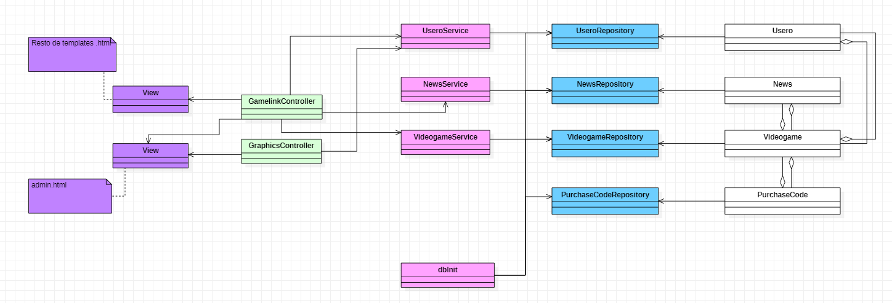

# Nombre de la aplicación web: 
GameLink

# Integrantes del equipo de desarrollo: 
| Nombre | Correo | Usuario GutHub |
| --- | --- | --- |
| Andrea Patricia Acuña Padrón | ap.acuna.2019@alumnos.urjc.es | andrecupa |
| Carlos Fuentes Díaz | c.fuentesd.2019@alumnos.urjc.es | Xarlifue360 |
| Jhostin Davis Ortiz Moreno | jd.ortiz.2019@alumnos.urjc.es | JhostinD | 
| Mani Víctor Patel Bentz | mv.patel.2019@alumnos.urjc.es | ultramani |
| Juan Luis Rico Rus | jl.rico.2019@alumnos.urjc.es | JLRR2019 |

# Herramienta de organización para el equipo:
Link Trello: 
* [Trello](https://trello.com/b/LKtXzdMY/organizaci%C3%B3n)

# Aspectos principales de la aplicación web:

## 1.ENTIDADES

La web consta de 4 entidades:

#### Usuario:
Id, nick, contraseña, tarjeta de crédito, Nombre, apellidos, foto perfil, correo electrónico, juegos comprados, noticias leídas.

#### Videojuego:
Id, Título, descripción, puntuación, carátula, empresa, precio, género, lista de noticias asociadas.

#### Noticias:
Id, Título, descripción, foto(opcional), autor, remesa, lista de videojuegos relacionados.

#### CódigoCompra:
Id, codigo de compra, nombre videojuego asociado, descuento.

Relaciones de las entidades:

El usuario administrador puede publicar de 0 a infinitas noticias, videojuegos y códigos.
 El usuario administrador puede eliminar y/o modificar de 0 a infinitas noticias, videojuegos y códigos publicados previamente.
Una noticia tiene uno o varios videojuegos asociados.
Un códigoCompra es de un videojuego.
Un usuario registrado compra de cero a infinitos videojuegos.
Un usuario puede visualizar noticias y videojuegos.

## 2.PERMISOS DE LOS USUARIOS

(la Web tiene que estar diseñada para que ciertos usuarios sean dueños de ciertos datos, importante para implementar correctamente los mecanismos de seguridad adecuados)
Para exponer los permisos de los usuarios se expondrán los tipos de usuario que se contemplan en la web y la funcionalidad que cumplen en la misma. 

#### Cliente anónimo: 
Usuario que no necesita de credenciales para acceder a la web. Podrá visualizar las noticias y los videojuegos más populares (más visitados y mejor valorados), debido a que no tiene preferencias. 
Además, no tendrá posibilidad de realizar compras

#### Cliente registrado:
Usuario que necesita credenciales para acceder a la web. Podrá visualizar noticias y videojuegos en base a sus preferencias (compras y visualizaciones anteriores). También tendrá posibilidad de realizar compras en la web.
Además, tendrá la opción de modificar sus credenciales (Nombre, Tarjeta, Foto de perfil, correo electrónico).

####  Administrador:
Usuario que necesita credenciales para acceder a la web. Podrá crear nuevas noticias y subir nuevos videojuegos (con su código 	asociado) para el consumo posterior de los usuarios cliente. 
Además, tendrá la opción de eliminar y/o modificar las noticias y los videojuegos previamente publicados.

## 3.IMÁGENES

Debido a que se trata de una página con 3 tipos de usuarios (usuario no registrado, registrado y administrador) es necesario determinar las posibilidades que tiene cada usuario de poder actualizar y subir fotografías.

### Usuario anónimo: 
no tiene permiso para poder subir fotografías.

### Usuario registrado: 
podrá subir y actualizar su foto de perfil que le caracteriza.

### Usuario administrador: 
el usuario administrador podrá cambiar cualquier imágen de la página. Esto incluye su foto de perfil, imágenes asociadas a cualquier noticia, así como las carátulas de los videojuegos en venta. En definitiva, puede cambiar cualquier imágen de la página web (excepto imágenes de perfil de usuarios registrados).

## 4. GRÁFICOS

La página web contará con un gráfico de barras, el cual medirá el número de ventas de un videojuego/barra, mostrando así todos los videojuegos.
Además constará de un gráfico de sectores, el cual mostrará las ventas por género a lo largo del tiempo. 

## 5. TECNOLOGÍA COMPLEMENTARIA

1-PSPDFKit API (Por ejemplo, posteriormente se verá que tecnología usar concretamente)
* Necesario generar PDFs para contener información relacionada con la compra de un usuario.
* [Link](https://pspdfkit.com/api/pdf-generator-api/?utm_source=google&utm_medium=paid_search&utm_campaign=api&utm_content=pdf-generation&utm_term=pdf%20generator%20api&gclid=CjwKCAiAl-6PBhBCEiwAc2GOVNUbRp1KtnHSWTmey5pwUE1ecnjAEe6iSfzhM2rQBNkAWvy9hXq_ShoC-LgQAvD_BwE)

## 6. ALGORITMO O CONSULTA AVANZADA

Principalmente existirá una funcionalidad que implementa un algoritmo basado cada uno en diferentes datos de las entidades:
* Se implementará un sistema que ofrezca a los usuarios registrados videojuegos que puedan interesarles basados en su historial de compra. La decisión sobre qué juegos ha comprado el usuario previamente, concretamente con el genero del mismo. 
De esta forma se mostraran los videojuegos cuyo genero sea el mismo al genero mas comprado del usuario

## Descripción de cada una de las pantallas (FASE 1).
Destacamos que en la barra de navegación "Administrador" sólo será visible para el administrador tras acceder como tal.
1. Registro: la pantalla de registro ofrecerá la posibilidad, a los usuarios no registrados, de registrarse. Esto permitirá acceder a todas las funcionalidades personalizadas de la página: videojuegos y noticias por preferencias y comprar videojuegos.

2. Inicio de sesión: permite a los usuarios previamente registrados acceder a la página web con usuario.

3. MenuHome: esta pantalla es principalmente la pantalla de bienvenida, con información general sobre noticias, compras y nuestro equipo, sin ahondar mucho en los detalles

4.Videojuegos: en ella se muestra la lista de videojuegos disponibles en la página web: los más populares para usuarios no registrados y una lista personalizada para usuarios registrados. Si se pincha en un videojuego se redirigirá a la pantalla VerVideojuego.

5. VerVideojuego es la pantalla que muestra en detalle la información de un videojuego y permite a los usuarios adquirir dicho videojuego por dinero.

6. About es la pantalla donde se muestra la información relacionada al euqipo de desarrollo de la página web GameLink.

7. VerNoticia: pantalla que permite ver con detalle cada noticia. Así como los videojuegos que la relacionan

8. Noticias: pantalla que permite ver las noticias más destacadas del día, así como la opción de poder acceder a ellas para ver cada noticia en detalle si optamos por pinchar en ellas.

9. Admin es la pantalla utilizada por los usuarios administradores para actualizar las noticias y videojuegos del catálogo. Además, se mostrarán los gráficos de las compras en la página web

9. Perfil es la pantalla en la que el usuario registrado podrá ver toda su información así como modificar los campos que le sean necesarios

9. Confirmación compra es la pantalla en la que el usuario registrado podrá ver el monto a pagar y el videojuego seleccionado para poder confirmar o cancelar su pedido

10. Error compra y Error login son las pantallas de error correspondientes cuando el usuario no está registrado e intenta comprar y cuando las credenciales del login no son correctos respectivamente. 

11. Top videojuegos: pantalla que permite ver los videojuegos mas populares del momento en base a sus puntuaciones.

## Diagrama de navegación (FASE 2)

## Instrucciones de Ejecución (Fase 2)

Para poder descargar el código del proyecto se debe acceder al GitHub, después pulsar el boton verde en el que pone CODE. Una vez lo hayamos pulsado aparecerá un desplegable en el que se tendrá la opción de descargar como ZIP.

El programa puede ser ejecutado tanto en Visual Studio Code como en SpringToolSuite4. Debido a que ha sido desarrollado en Visual Studio Code, las instrucciones serán para este entorno en concreto.

Para poder utilizar Visual Studio Code, deberemos dirigirnos a la página oficial y descargar el programa para el sistema operativo que se desee

La versión Java necesaria es la 17, a su vez requiere la versión PostgreSQL 6.4 y Maven 4.0.0.

Para poder usar Java y Maven, primero deberemos descargar las extensiones. El proceso será el siguiente:

Primero vamos al apartado "Extensions"

A continuación, debemos descargar el Extension Pack for Java y Spring Boot Extension Pack

Llegados a este punto necesitaremos descargar la base de datos. En este caso se ha usado PostgreSQL 6.4

Debemos crear un servidor en la base de datos.

El username y la password del servidor deben de ser los mismos que los que están en apartado application.properties. Además debemos configurar el puerto que vayamos a utilizar

Para proceder a la ejecución del programa, primero se debe abrir la pestaña application.properties, de lo contrario no aparecerá el Spring Boot Dashboard (Instalado previamente mediante la extensión). Una vez abierta, se puede proceder a la ejecución del programa

# Diagrama de Clases (Fase 2)

# Modelo  ER (Fase 2)

# Participación de miembros (Fase 2):

### Andrea Patricia Acuña Padrón
###### Descripción textual de las tareas realizadas en la fase: 
  - Login: Realización del login del usuario. Se debe comprobar que el usuario está en la base de datos y que los campos de nombre y contraseña coinciden. Además, si hay algún error como que no está el usuario en la base de datos saldrá una pantalla de error. 
  - Editar perfil usuario: Visualización de una pantalla del perfil del usuario con los datos del mismo. Además, se podrán modificar los campos del usuario así como la foto de perfil. Se contará con un botón para guardar los cmabios y otro para deshacer los mismos.
  - Gráfica de géneros: Consulta Query de los videojuegos vendidos por género y su visualización por gráfico en admin.html
  - Compra videojuego: Botón en cada uno de los videojuegos. Dicho botón redirige a un error si el usuario no está loggeado y a una pantalla de confirmación de compra si el usuario si está loggeado. Una vez comprado el videojuego, este pertenecerá al usuario apareciendole la compra en su perfil.

###### Listado de los 5 commits más significativos durante la fase:
 1. [Payment error id videogame](https://github.com/CodeURJC-DAW-2021-22/webapp9/commit/d14439a8e898589cee1edc0dfebf393c95931ebd)
 2. [Gráfica videojuegos genero terminada](https://github.com/CodeURJC-DAW-2021-22/webapp9/commit/5ad0b54b49bf4f347666071e44702ccffd7ea8af)
 3. [botón compra finalizado + pequeños arreglos estéticos](https://github.com/CodeURJC-DAW-2021-22/webapp9/commit/434c519edc1d4fdc92f0c623013520684dcfd985)
 4. [Modificar perfil](https://github.com/CodeURJC-DAW-2021-22/webapp9/commit/515c8b0e163bc34b55bb0439cbcda2237245e73f)
 5. [continuación del perfil](https://github.com/CodeURJC-DAW-2021-22/webapp9/commit/15f9aedc20dc3c69d736ea388c36e2a657766c4f)

###### Listado de los 5 ficheros en los que más haya participado:
1. [Login.html](https://github.com/CodeURJC-DAW-2021-22/webapp9/blob/main/backend/gamelink/src/main/resources/templates/login.html)
2. [UserProfile.html](https://github.com/CodeURJC-DAW-2021-22/webapp9/blob/main/backend/gamelink/src/main/resources/templates/userProfile.html)
3. [CSRFHandlerConfiguration.java](https://github.com/CodeURJC-DAW-2021-22/webapp9/blob/main/backend/gamelink/src/main/java/urjc/gamelink/Configuration/CSRFHandlerConfiguration.java)
4. [GamelinkController.java](https://github.com/CodeURJC-DAW-2021-22/webapp9/blob/main/backend/gamelink/src/main/java/urjc/gamelink/Controllers/GamelinkController.java)
5. [UseroRepository.java](https://github.com/CodeURJC-DAW-2021-22/webapp9/blob/main/backend/gamelink/src/main/java/urjc/gamelink/Repositories/UseroRepository.java)

### Mani Victor Patel Bentz
###### Descripción textual de las tareas realizadas en la fase: 
- En esta fase me he encargado de implementar que se pueda crear/eliminar/editar videojuegos y noticias, templates y funciones de controlador. 
- Creado los templates y funciones de controlador para cargar de base de datos la información asociada a cada videojuego o noticia. 
- Implementado el protocolo https y agregado en el servicio de seguridad que dependiendo del rol de un usuario pueda o no acceder a ciertas URLs. 
- Implementado también el algoritmo de personalizado. 
- Ajustado nuestras relaciones entre entidades y lo que conlleva en el código. 
- Finalmente, algún hotfix me ha sido encargado.

###### Listado de los 5 commits más significativos durante la fase:

1. [Me he adelantado este commit no vale](https://github.com/CodeURJC-DAW-2021-22/webapp9/tree/544869dcfb29b2db7245287fb8dc071d8ba85d6e)
2. [Remove/Edit implemented, but Remove has errors](https://github.com/CodeURJC-DAW-2021-22/webapp9/commit/4176b34a9d399172164bf8545880c9134b6f7b73)
3. [Added games and news](https://github.com/CodeURJC-DAW-2021-22/webapp9/commit/46f85740e30eca420c4871ff7009868e0c058526)
4. [Various fixes, most important edit and create videogame/new works](https://github.com/CodeURJC-DAW-2021-22/webapp9/commit/c4de66fe183f8156e9b131917e98178b15f70c0f)
5. [Forms completed](https://github.com/CodeURJC-DAW-2021-22/webapp9/commit/5a065adb48ee5b4a2517ea4b8954a60e8fb57c40)

###### Listado de los 5 ficheros en los que más haya participado:

1. [GamelinkController.java](https://github.com/CodeURJC-DAW-2021-22/webapp9/blob/main/backend/gamelink/src/main/java/urjc/gamelink/Controllers/GamelinkController.java)
2. [Videogame.java](https://github.com/CodeURJC-DAW-2021-22/webapp9/tree/main/backend/gamelink/src/main/java/urjc/gamelink/Model)
3. [WebSecurityConfig.java](https://github.com/CodeURJC-DAW-2021-22/webapp9/blob/main/backend/gamelink/src/main/java/urjc/gamelink/Configuration/WebSecurityConfig.java)
4. [editNewForm.html](https://github.com/CodeURJC-DAW-2021-22/webapp9/blob/main/backend/gamelink/src/main/resources/templates/editNewForm.html)
5. [createVideogame.html](https://github.com/CodeURJC-DAW-2021-22/webapp9/blob/main/backend/gamelink/src/main/resources/templates/createNew.html)

### Carlos Fuentes Díaz
###### Descripción textual de las tareas realizadas en la fase:
- Templates mensaje de error al comprar un juego y confirmar compra: creación de las templates para el mensaje error y la confirmación de la compra
- Inicializar la BBDD: Se han introducido a la base de datos los 20 primeros videojuegos y las 20 primeras noticias de la página web.
- Estética de la página web: En este apartado se ha mejorado la estética general de toda la página web, ya sean los colores, texto o que la página web sea más atractiva a la vista.
- Hacer un navegador más dinámico: Cuando estas registrado como usuario no registrado, como usuario o como administrador, que en el navegador de la página web se muestren las pestañas que les corresponda a cada uno
- Grafica de videojuegos vendidos: Consulta Query de todos los videojuegos vendidos y su visualización por grafico en admin.html

###### Listado de los 5 commits más significativos durante la fase:
1. [1ºparte de verificacionCompra/mensaje de error](https://github.com/CodeURJC-DAW-2021-22/webapp9/tree/e271495aec51c17330652f6896364e8949936512)
2. [cambiado a ingles](https://github.com/CodeURJC-DAW-2021-22/webapp9/tree/5af0efce13629c127dc1457c634fc692b75d75cb)
3. [actualizar bbdd videojuegos 1ºparte](https://github.com/CodeURJC-DAW-2021-22/webapp9/tree/c06c23ecd9663ef69334d2a0d4817c601d87c1de)
4. [actualizar bbdd terminado](https://github.com/CodeURJC-DAW-2021-22/webapp9/tree/f979fb0ff7cddde61fb0a6f6e4262f8d482f88ad)
5. [grafica de juegos vendidos TERMINADO](https://github.com/CodeURJC-DAW-2021-22/webapp9/tree/abd347d402fbfe69e3c4a69cd4fe9022ebc2a0bf)

###### Listado de los 5 ficheros en los que más haya participado:
1. [styles.css](https://github.com/CodeURJC-DAW-2021-22/webapp9/blob/main/backend/gamelink/src/main/resources/static/css/styles.css)
2. [paymentConfirmation.html](https://github.com/CodeURJC-DAW-2021-22/webapp9/blob/main/backend/gamelink/src/main/resources/templates/paymentConfirmation.html)
3. [bdinit.java](https://github.com/CodeURJC-DAW-2021-22/webapp9/blob/main/backend/gamelink/src/main/java/urjc/gamelink/Service/dbInit.java)
4. [scripts.js](https://github.com/CodeURJC-DAW-2021-22/webapp9/blob/main/backend/gamelink/src/main/resources/static/js/scripts.js)
5. [GamelinkController.java](https://github.com/CodeURJC-DAW-2021-22/webapp9/blob/main/backend/gamelink/src/main/java/urjc/gamelink/Controllers/GamelinkController.java)

### Juan Luis Rico Rus
###### Descripción textual de las tareas realizadas en la fase:
- Paginación: Todas las tareas para realizar la paginación de manera correcta. 
- Puntuación: Incorporación del sistema de puntuación para los videojuegos (Pendiente de subir al main en Juan-Deprecated)
- Pequeñas cosas como mejora: incorporación del navBar con moustache, incorporación de atributos a las entidades para el uso de las estrellas, cualquier arreglo, etc.
###### Listado de los 5 commits más significativos durante la fase:
1. [avance paginacion pero no funciona](https://github.com/CodeURJC-DAW-2021-22/webapp9/commit/b2417175fbfe16eff11043bd4c67c80fd33fd07d)
2. [pequeño avance, al menos cambia los elementos al pasar de pagina](https://github.com/CodeURJC-DAW-2021-22/webapp9/commit/a1365abc4bc88003b506098a0a0b23038b9d0b86)
3. [paginacion con ajax casi hecha](https://github.com/CodeURJC-DAW-2021-22/webapp9/commit/22dcaf450309e819dd3afac3023b1695512bf651)
4. [Ya funciona, no esta ni mucho menos perfecto pero ya funciona](https://github.com/CodeURJC-DAW-2021-22/webapp9/commit/e2ae0ead821cf8d39e4bdd6dd02013716e3dc75b)
5. [Puntuaciones medias funcionando (tienen un pequeño error tengo que solucionarlo)](https://github.com/CodeURJC-DAW-2021-22/webapp9/commit/6584457312bb9d9460ea6af6000192bc44d521e2)

###### Listado de los 5 ficheros en los que más haya participado:
1. [GamelinkController.java](https://github.com/CodeURJC-DAW-2021-22/webapp9/blob/main/backend/gamelink/src/main/java/urjc/gamelink/Controllers/GamelinkController.java)
2. [scripts.js](https://github.com/CodeURJC-DAW-2021-22/webapp9/blob/main/backend/gamelink/src/main/resources/static/js/scripts.js)
3. [styles.css](https://github.com/CodeURJC-DAW-2021-22/webapp9/blob/main/backend/gamelink/src/main/resources/static/css/styles.css)
4. [showVideogame.html](https://github.com/CodeURJC-DAW-2021-22/webapp9/blob/main/backend/gamelink/src/main/resources/templates/showVideogame.html)
5. [videogame](https://github.com/CodeURJC-DAW-2021-22/webapp9/blob/main/backend/gamelink/src/main/resources/templates/videogame.html)

### Jhostin Davis Ortiz Moreno
###### Descripción textual de las tareas realizadas en la fase:
- Registro: Formulario para guardar nuevos usuarios. Implementado con ciertas medidas de seguridad para no guardar usuarios sin credenciales en la BD.
- Algoritmo de consulta avanzada: Query SQL para recomendar juegos a los usuarios registrados en función de los géneros de los videojuegos que ya hayan comprado.
- Header y Footer unificados con mustache: Header y Footer implementados en forma de templates .html que se incrustarán mediante mustache en el resto de páginas html.
- Creación de las entidades: Creación de las clases que actuarán como entidades en la BD.
- Configuración inicial del proyecto con Maven: configurado el proyecto mediante plantilla Maven. pom.xml dentro de carpeta backend.

###### Listado de los 5 commits más significativos durante la fase:
1. [Primer avance algoritmo consulta avanzada](https://github.com/CodeURJC-DAW-2021-22/webapp9/commit/4043b4dcd82030654058ac1554cc5d9fedfa5fee)
2. [Usuarios Nuevos se crean correctamente (Falta formulario con js correctamente implementado)](https://github.com/CodeURJC-DAW-2021-22/webapp9/commit/1c04924ea917ab3f1496572cbe80a69c46e1b2a3)
3. [Header y Footer genéricos en todas las páginas](https://github.com/CodeURJC-DAW-2021-22/webapp9/commit/731925a234f137817f699a8f0ff3f0dc03da120d)
4. [Carpeta backend](https://github.com/CodeURJC-DAW-2021-22/webapp9/commit/94b5cc989115249cef59a5bbf961db7c52d66a52)
5. [Primera versión entidades](https://github.com/CodeURJC-DAW-2021-22/webapp9/commit/159fd74109c92898ec25c4fbd5197004af544a21)

###### Listado de los 5 ficheros en los que más haya participado:
1. [script.js](https://github.com/CodeURJC-DAW-2021-22/webapp9/blob/main/backend/gamelink/src/main/resources/static/js/scripts.js)
2. [Usero.java](https://github.com/CodeURJC-DAW-2021-22/webapp9/blob/main/backend/gamelink/src/main/java/urjc/gamelink/Model/Usero.java)
3. [GamelinkController.java](https://github.com/CodeURJC-DAW-2021-22/webapp9/blob/main/backend/gamelink/src/main/java/urjc/gamelink/Controllers/GamelinkController.java)
4. [Videogame.java](https://github.com/CodeURJC-DAW-2021-22/webapp9/blob/main/backend/gamelink/src/main/java/urjc/gamelink/Model/Videogame.java)
5. [VideogameRepository.java](https://github.com/CodeURJC-DAW-2021-22/webapp9/blame/main/backend/gamelink/src/main/java/urjc/gamelink/Repositories/VideogameRepository.java)

# Documentación de la API REST(Fase 3)

## Especificación openAPI
- [archivo yaml](backend/gamelink/api-docs/api-docs.yaml)

## Documento HTML
- [enlaze](https://rawcdn.githack.com/CodeURJC-DAW-2021-22/webapp9/7c9569b82c7b36f569e645f98066d7feb7ca2c81/backend/gamelink/api-docs/api-docs.html)

